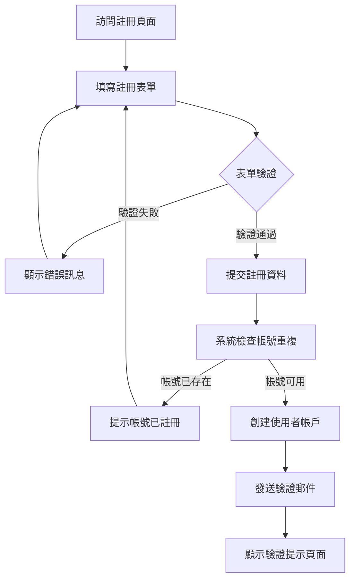
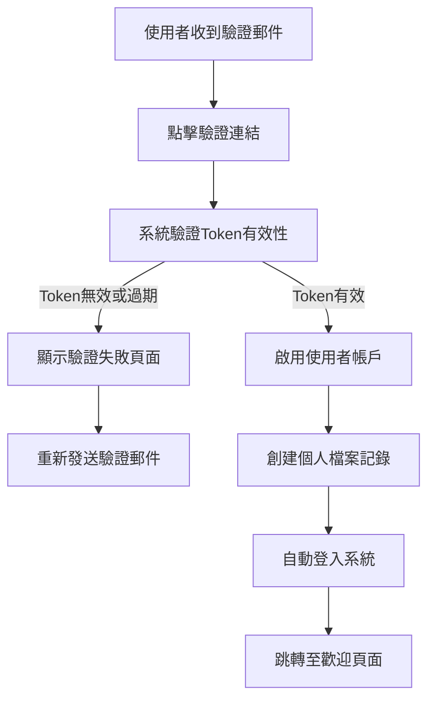
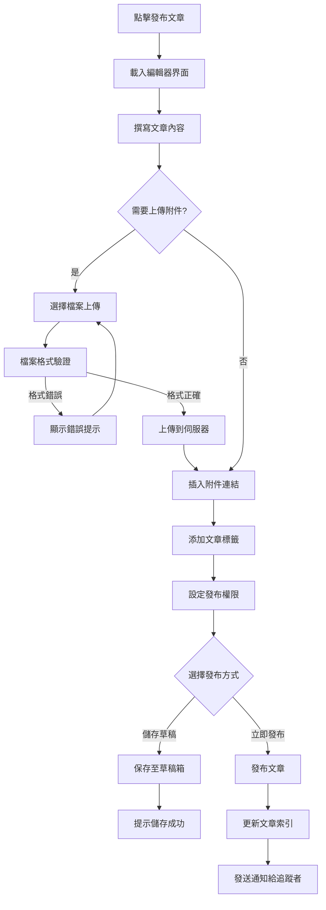
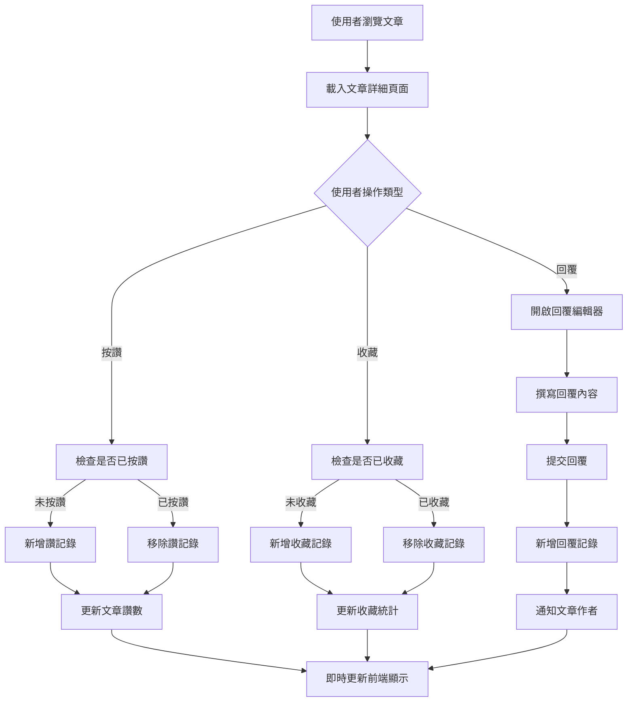
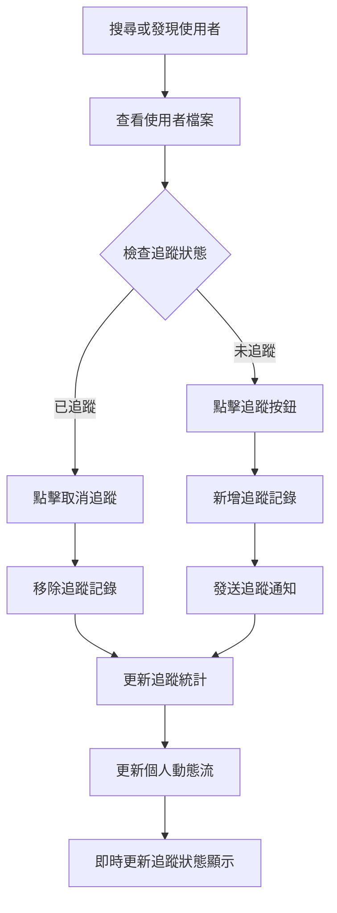
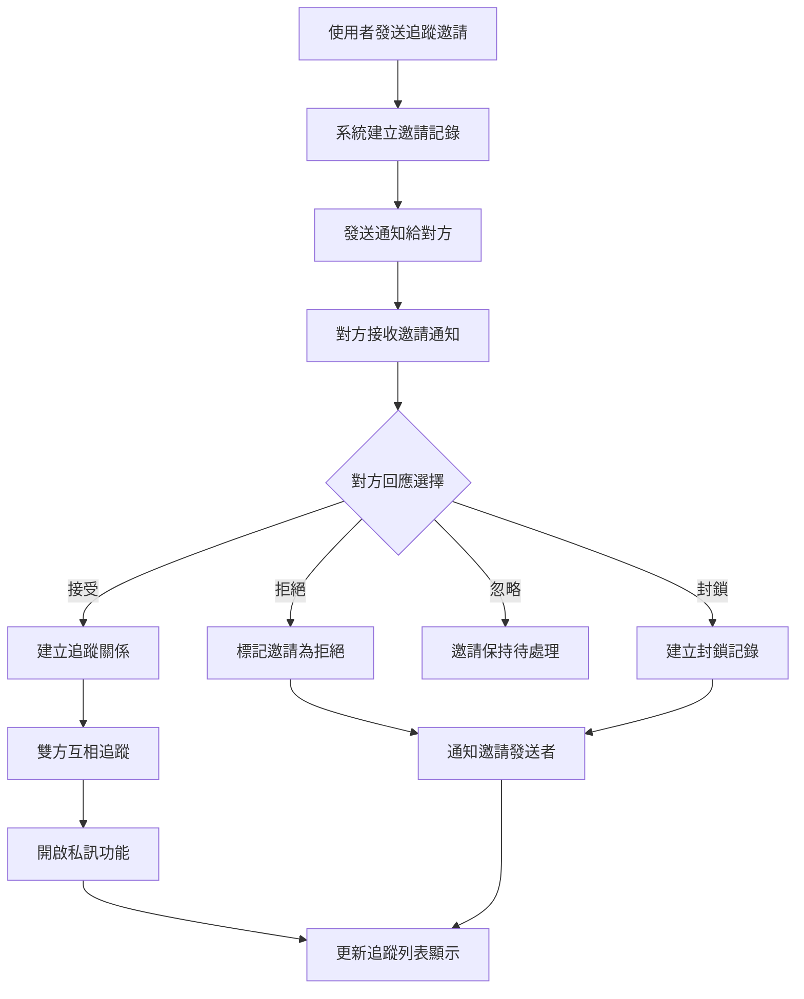
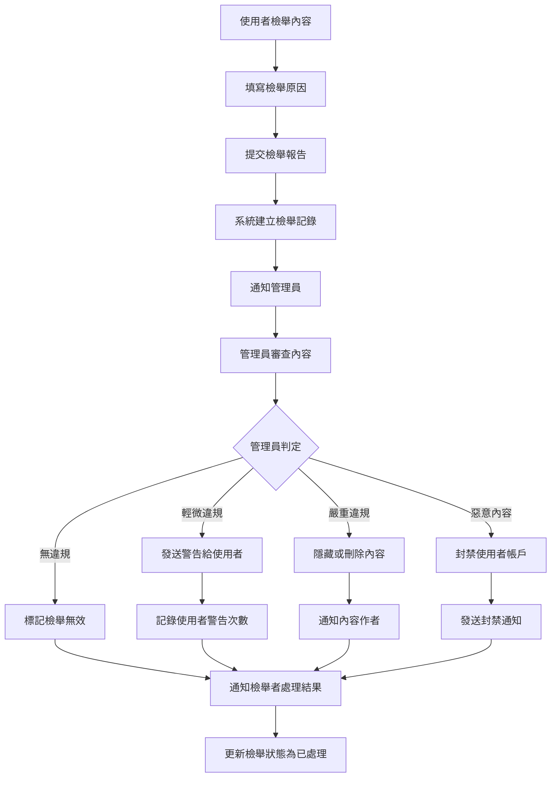
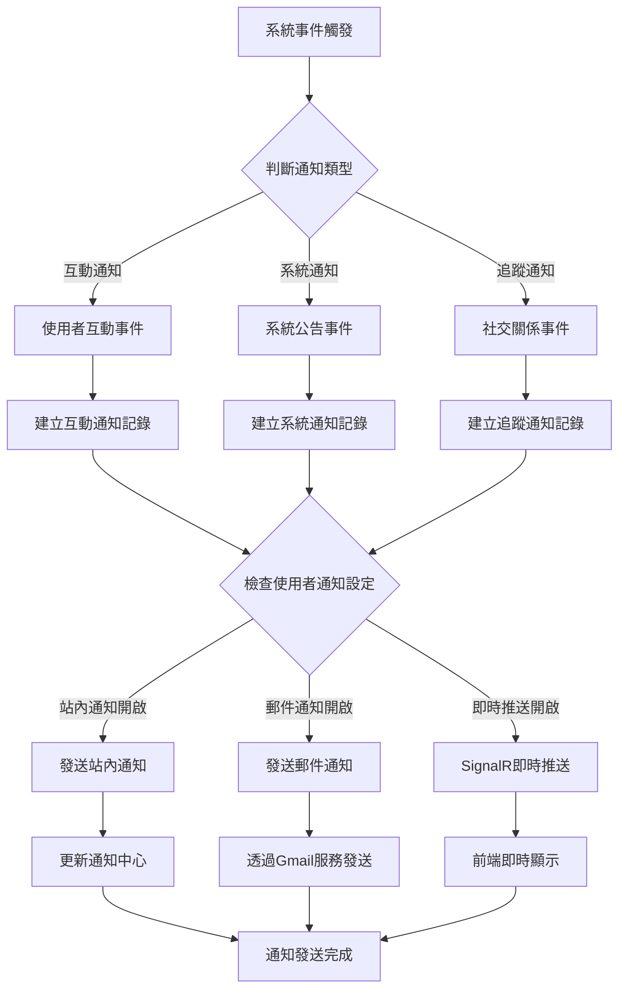
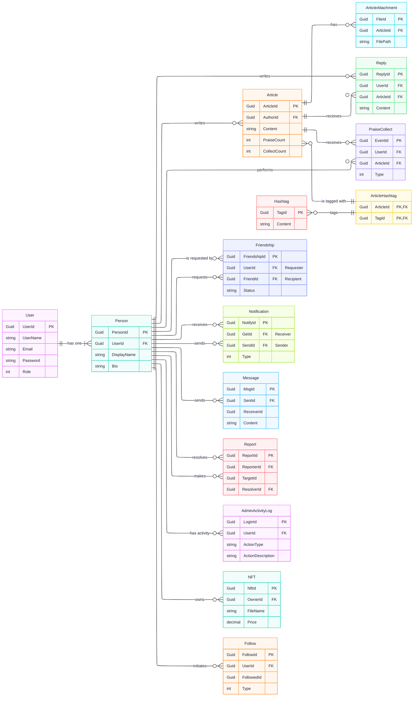

# 目錄

ㄧ、專題緣起
二、主要功能
  （一）預計完成功能
  （二）實際完成功能
  （三）系統操作流程
  （四）內容創作與管理流程
  （五）社交功能流程
  （六）理與治理流程
  （七）網站地圖
三、專題分工
四、使用技術（技術文件）
  （一）開發工具
  （二）登入驗證/使用者角色
  （三）使用者個人頁面編輯
五、ER-Model
六、設計圖
  （一）首頁
      1-1 動態消息 
      1-2 搜尋浮動視窗
      1-3 訊息浮動視窗
      1-4 追蹤浮動視窗
      1-5 收藏浮動視窗
  （二）個人頁面
      2-1 個人頁面
      2-2 編輯個人資訊浮動視窗
  （三）會員
      3-1 登入頁面設計
        3-1-1 忘記密碼信箱頁面設計
      3-2 註冊頁面設計
        3-2-1 驗證信信箱頁面設計
  （四）後臺
      4-1 儀表板
      4-2 使用者管理
      4-3 貼文管理
      4-4 檢舉管理
      4-5 管理員管理

---

# 專案緣起
  現今大多數的社群平台都會顯示太多不必要的資訊，就算透過演算法過濾，也會提供惱人的廣告及資訊給使用者。而 Matrix 正是為那些對 WEB3 研究者、深度技術使用者、感興趣的人所打造的世外桃源。可以盡情地在該社群平台上討論與分享新的 WEB3 技術。

# 主要功能

## （一）預計完成功能

### 🔐 使用者管理功能
- 使用者註冊與登入系統
- JWT Token 身份驗證機制
- 個人檔案管理（頭像、橫幅、個人簡介）
- 隱私控制設定
- 登入記錄與安全追蹤

### 📝 內容創作功能
- 富文本文章編輯器（CKEditor5）
- 多媒體附件上傳系統
- 標籤（Hashtag）分類功能
- 文章狀態管理（公開/私人、草稿/發布）
- 文章版本控制

### 💬 社交互動功能
- 文章留言與回覆系統
- 讚與收藏功能
- 使用者追蹤機制
- 雙向追蹤系統
- 即時通訊功能（SignalR）

### 🔍 搜尋與探索功能
- 全文搜尋引擎
- 標籤分類瀏覽
- 使用者搜尋功能
- 熱門內容推薦
- 個人化內容推送

### 🔔 通知系統
- 即時通知中心
- 互動提醒功能
- 追蹤邀請通知
- 系統公告推送
- 郵件通知整合

### 🛡️ 管理與治理功能
- 內容檢舉系統
- 管理員後台界面
- 使用者權限管理
- 系統活動日誌
- 內容審核機制

### 🌐 系統功能
- 多語言支援（繁中/英文）
- 響應式網頁設計
- 翻譯服務整合
- 郵件服務系統
- 忘記密碼重設功能

## （二）實際完成功能

### ✅ **已完成的核心功能模組**

#### 🔐 **使用者認證與管理系統** 
**完成度：100%**
- ✅ 使用者註冊系統（`RegisterController.cs` + API）
- ✅ JWT Token 登入驗證（`LoginController.cs` + `AuthController.cs`）
- ✅ 郵箱驗證機制（`GmailService.cs`）
- ✅ 忘記密碼重設（`ForgotPasswordController.cs`）
- ✅ 登入記錄追蹤（`LoginRecord.cs` 模型）
- ✅ 使用者權限分級（Admin/Member/User）

#### 📝 **內容管理系統**
**完成度：100%**
- ✅ 文章發布功能（`PostController.cs` + `ArticleService.cs`）
- ✅ 富文本編輯器整合（CKEditor5）
- ✅ 文章附件上傳（`ArticleAttachment.cs` 模型）
- ✅ 標籤系統（`Hashtag.cs` + `HashtagService.cs`）
- ✅ 文章狀態管理（`PostStateController.cs`）
- ✅ 草稿儲存功能

#### 💬 **社交互動系統**
**完成度：95%**
- ✅ 文章回覆功能（`ReplyController.cs` + `ReplyService.cs`）
- ✅ 讚與收藏系統（`PraiseCollect.cs` + `PraiseService.cs`）
- ✅ 使用者追蹤（`FollowsController.cs` + `FollowService.cs`）
- ✅ 追蹤系統（`FriendshipController.cs` + `FriendshipService.cs`）
- ✅ 即時聊天功能（`ApiChatController.cs` + SignalR）

#### 🔍 **搜尋與探索系統**
**完成度：100%**
- ✅ 全文搜尋功能（`SearchController.cs`）
- ✅ 使用者搜尋（`SearchUserService.cs`）
- ✅ 標籤搜尋（`SearchHashtagService.cs`）
- ✅ 熱門內容推薦（PostController.cs 中的 `GetHot` 方法）

#### 🔔 **通知系統**
**完成度：100%**
- ✅ 通知中心（`NotifyController.cs` + `NotificationService.cs`）
- ✅ 即時推送（SignalR 整合）
- ✅ 郵件通知（`GmailService.cs`）
- ✅ 多類型通知處理

#### 🛡️ **管理與治理系統**
**完成度：90%**
- ✅ 檢舉系統（`ReportsController.cs` + `ReportService.cs`）
- ✅ 管理員後台（`AdminController.cs`）
- ✅ 使用者權限管理（`AdminPermissionService.cs`）
- ✅ 活動日誌（`ActivityLogController.cs`）
- ✅ NFT 功能（`NftController.cs` + `NFTService.cs`）

#### 🌐 **系統支援功能**
**完成度：100%**
- ✅ 多語言本地化（`CustomLocalizer.cs`）
- ✅ 翻譯服務（`TranslationController.cs`）
- ✅ 個人檔案管理（`ProfileController.cs`）
- ✅ 郵件服務（Gmail SMTP）
- ✅ 檔案上傳服務（`FileService.cs`）

### 🗃️ **完整的資料庫架構**
**已實現的資料模型：**
- `User.cs` - 使用者帳戶
- `Person.cs` - 個人檔案
- `Article.cs` - 文章內容
- `Reply.cs` - 文章回覆
- `PraiseCollect.cs` - 讚與收藏
- `Follow.cs` - 追蹤關係
- `Friendship.cs` - 追蹤關係
- `Notification.cs` - 通知系統
- `Report.cs` - 檢舉系統
- `Hashtag.cs` + `ArticleHashtag.cs` - 標籤系統
- `ArticleAttachment.cs` - 附件系統
- `Message.cs` - 聊天訊息
- `LoginRecord.cs` - 登入記錄
- `NFT.cs` - NFT 功能

### 🎯 **已完成的前端頁面**
**主要視圖頁面：**
- ✅ 首頁（`Home/Index.cshtml`）
- ✅ 登入頁面（`Auth/Login.cshtml`）
- ✅ 註冊頁面（`Auth/Register.cshtml`）
- ✅ 個人檔案頁面（`Profile/Index.cshtml`）
- ✅ 追蹤頁面（`Follow/Follow.cshtml`）
- ✅ 通知頁面（`Notify/Notify.cshtml`）
- ✅ 關於我們頁面（`About/index.cshtml`）
- ✅ 聯絡我們頁面（`ContactUs/index.cshtml`）

**組件系統（ViewComponents）：**
- ✅ 文章列表（`PostList`）
- ✅ 創建文章彈窗（`CreatePostPopup`）
- ✅ 回覆彈窗（`ReplyPopup`）
- ✅ 聊天彈窗（`ChatPopup`）
- ✅ 個人檔案編輯彈窗（`EditProfilePopup`）
- ✅ 追蹤列表（`FriendsList`）
- ✅ NFT 收藏列表（`NftCollectsList`）

### 📊 **API 端點完成統計**
**已實現的 API 控制器（18 個）：**
- `AuthController` - 認證狀態檢查
- `LoginController` - 登入處理
- `RegisterController` - 註冊處理
- `PostController` - 文章管理（包含熱門文章）
- `ReplyController` - 回覆管理
- `ProfileController` - 個人檔案
- `FollowsController` - 追蹤功能
- `FriendshipController` - 追蹤系統
- `NotifyController` - 通知管理
- `SearchController` - 搜尋功能
- `AdminController` - 管理後台
- `ReportsController` - 檢舉系統
- `NftController` - NFT 功能
- `ApiChatController` - 聊天功能
- `TranslationController` - 翻譯服務
- `PostStateController` - 文章狀態
- `ActivityLogController` - 活動日誌
- `ForgotPasswordController` - 密碼重設

### 🎨 **UI/UX 設計完成度**
**設計系統：**
- ✅ Tailwind CSS + DaisyUI 整合
- ✅ 響應式設計實現
- ✅ 深色主題風格（符合 Web3 氣氛）
- ✅ 自定義品牌配色方案
- ✅ Lucide 圖標系統整合
- ✅ 多語言界面支援

### 🔧 **技術架構完成度**
**後端服務層（48 個服務類別）：**
- 商業邏輯服務完整實現
- Repository 模式實作
- 依賴注入架構完善
- AutoMapper 物件映射
- Memory Cache 快取機制
- SignalR 即時通訊

**安全性與效能：**
- ✅ JWT Token 認證機制
- ✅ Anti-forgery Token 防護
- ✅ Data Protection 金鑰管理
- ✅ 回應壓縮（Brotli/Gzip）
- ✅ CORS 跨域設定
- ✅ 輸入驗證與清理

### 📈 **實際運作流程**

#### 1. **使用者註冊與登入流程**（已完全實現）
```
用戶訪問 → 註冊頁面 → 填寫資料 → 郵箱驗證 → 帳戶啟用 → 自動登入
         ↓
    登入頁面 → JWT 驗證 → Cookie 設置 → 主頁跳轉
```

#### 2. **文章發布與互動流程**（已完全實現）
```
創建文章 → 富文本編輯 → 標籤添加 → 附件上傳 → 發布文章
         ↓
用戶瀏覽 → 文章互動（讚/收藏/回覆） → 即時通知 → 統計更新
```

#### 3. **社交功能流程**（已完全實現）
```
搜尋用戶 → 查看檔案 → 追蹤/追蹤邀請 → 通知發送 → 關係建立
         ↓
即時聊天 → SignalR 連接 → 訊息傳送 → 即時顯示
```

#### 4. **管理系統流程**（已基本實現）
```
內容檢舉 → 管理員審核 → 處置決定 → 通知相關方 → 記錄日誌
```

### 🚧 **待優化項目**
**功能完善度：95%**
- 🔄 部分 UI 細節優化
- 🔄 測試覆蓋率提升
- 🔄 效能監控完善
- 🔄 錯誤處理機制強化

## （三）系統操作流程

### 1. 使用者註冊流程
```
開始 → 填寫註冊資料 → 郵箱驗證 → 創建個人檔案 → 完成註冊
                ↓
    驗證失敗 ← 重新驗證 ← 檢查郵箱
```

**詳細流程**：
1. 使用者訪問註冊頁面
2. 填寫基本資料（使用者名稱、郵箱、密碼）
3. 系統發送驗證郵件
4. 使用者點擊驗證連結
5. 創建個人檔案（顯示名稱、個人簡介等）
6. 註冊完成，自動登入系統

### 2. 使用者登入流程
```
開始 → 輸入帳密 → 驗證身份 → 生成JWT → 設置Cookie → 登入成功
         ↓
    登入失敗 ← 錯誤訊息 ← 驗證失敗
         ↓
    忘記密碼 → 郵箱重設 → 重新登入
```

**詳細流程**：
1. 使用者輸入帳號密碼
2. 系統驗證使用者身份
3. 驗證成功生成 JWT Token
4. Token 存儲於 Cookie 中
5. 記錄登入資訊（IP、UserAgent）
6. 跳轉至主頁面

### 3. 文章發布流程
```
開始 → 撰寫文章 → 添加標籤 → 上傳附件 → 設定隱私 → 預覽文章 → 發布文章
         ↓
    儲存草稿 ← 暫存功能 ← 編輯中斷
                              ↓
                          恢復編輯 → 繼續撰寫
```

**詳細流程**：
1. 使用者點擊「發布文章」按鈕
2. 進入富文本編輯器界面
3. 撰寫文章內容（支援 Markdown 語法）
4. 添加相關標籤分類
5. 上傳附件檔案（圖片、文件等）
6. 設定文章隱私（公開/私人）
7. 預覽文章最終效果
8. 確認發布或儲存為草稿

### 4. 社交互動流程
```
瀏覽文章 → 閱讀內容 → 互動操作
                        ↓
                ┌─── 按讚/收藏 ───┐
                ↓                ↓
            更新統計 → 發送通知 → 記錄互動
                ↓
            撰寫回覆 → 提交回覆 → 通知作者
```

**詳細流程**：
1. 使用者瀏覽文章列表
2. 點擊文章進入詳細頁面
3. 閱讀文章內容
4. 執行互動操作：
   - 點讚：更新讚數統計，發送通知給作者
   - 收藏：加入個人收藏清單
   - 回覆：撰寫留言回覆，通知相關使用者
   - 分享：產生分享連結

### 5. 追蹤系統流程
```
搜尋使用者 → 查看檔案 → 發送追蹤邀請 → 等待回應
                                    ↓
對方接收 → 查看邀請 → 接受/拒絕 → 更新追蹤關係
    ↓                      ↓
通知發送者 ← 關係確立 ← 接受邀請
    ↓
開始互動 → 私訊聊天 → 追蹤動態
```

**詳細流程**：
1. 使用者搜尋其他使用者
2. 查看目標使用者個人檔案
3. 發送追蹤邀請請求
4. 系統發送通知給對方
5. 對方查看邀請詳情
6. 選擇接受、拒絕或封鎖
7. 系統更新追蹤關係狀態
8. 雙方收到結果通知

### 6. 通知系統流程
```
觸發事件 → 判斷通知類型 → 生成通知內容 → 發送通知
    ↓                                       ↓
互動事件                              ┌─ 站內通知
追蹤邀請                              │
系統公告                              ├─ 郵件通知
內容審核                              │
                                     └─ 即時推送
                                          ↓
                                    使用者接收 → 標記已讀
```

**詳細流程**：
1. 系統監聽各種觸發事件
2. 根據事件類型判斷通知方式
3. 生成對應的通知內容
4. 多通道發送通知：
   - 站內通知：顯示在通知中心
   - 郵件通知：發送到使用者郵箱
   - 即時推送：透過 SignalR 即時顯示
5. 使用者接收並查看通知
6. 標記通知為已讀狀態

### 7. 內容管理流程
```
內容發布 → 自動檢測 → 通過審核 → 公開顯示
    ↓           ↓
被檢舉 ← 人工審核 ← 疑似違規
    ↓           ↓
管理員處理 → 判定結果 → 執行處置
    ↓
通知相關方 ← 記錄日誌 ← 完成處理
```

**詳細流程**：
1. 使用者發布內容
2. 系統自動內容檢測
3. 正常內容直接公開顯示
4. 疑似違規內容進入人工審核
5. 其他使用者可檢舉不當內容
6. 管理員接收檢舉通知
7. 審核內容並做出處置決定：
   - 保留：維持原狀
   - 隱藏：暫時下架
   - 刪除：永久移除
   - 警告：通知作者修正
8. 通知相關使用者處理結果
9. 記錄管理操作日誌

### 8. 搜尋與探索流程
```
輸入關鍵字 → 選擇搜尋類型 → 執行搜尋 → 顯示結果
                ↓
        ┌─ 文章搜尋 ─┐
        ↓            ↓
    ├─ 使用者搜尋    結果排序 ← 相關度計算
    ↓                ↓
    └─ 標籤搜尋     結果過濾 ← 權限檢查
                     ↓
                 分頁顯示 → 點擊查看詳情
```

**詳細流程**：
1. 使用者在搜尋框輸入關鍵字
2. 選擇搜尋類型（文章/使用者/標籤）
3. 系統執行全文搜尋
4. 根據相關度排序結果
5. 過濾使用者無權限查看的內容
6. 分頁顯示搜尋結果
7. 使用者點擊查看詳細內容
8. 記錄搜尋歷史與偏好

## （三）使用者註冊詳細流程圖

### 註冊頁面流程


### 郵箱驗證流程


## （四）內容創作與管理流程

### 文章編輯流程


### 文章互動流程


## （五）社交功能流程

### 追蹤使用者流程


### 追蹤邀請處理流程


## （六）管理與治理流程

### 內容檢舉處理流程


### 系統通知管理流程


## （七）網站地圖

### 主要頁面結構
```
Matrix 首頁 (/)
├── 使用者認證
│   ├── 登入頁面 (/login)
│   ├── 註冊頁面 (/register)
│   └── 忘記密碼 (/forgot-password)
│
├── 內容區域
│   ├── 文章列表 (/posts)
│   ├── 文章詳細 (/post/{id})
│   ├── 發布文章 (/create-post)
│   └── 標籤瀏覽 (/tags)
│
├── 個人空間
│   ├── 個人檔案 (/profile/{username})
│   ├── 個人設定 (/profile/settings)
│   ├── 我的文章 (/profile/posts)
│   ├── 我的收藏 (/profile/collections)
│   └── 我的草稿 (/profile/drafts)
│
├── 社交功能
│   ├── 追蹤列表 (/friends)
│   ├── 追蹤清單 (/following)
│   ├── 粉絲清單 (/followers)
│   └── 私訊聊天 (/chat)
│
├── 互動中心
│   ├── 通知中心 (/notifications)
│   ├── 搜尋頁面 (/search)
│   └── 探索頁面 (/explore)
│
├── 系統頁面
│   ├── 關於我們 (/about)
│   ├── 聯絡我們 (/contact)
│   ├── 使用條款 (/terms)
│   └── 隱私政策 (/privacy)
│
└── 管理後台 (/admin)
    ├── 使用者管理 (/admin/users)
    ├── 內容管理 (/admin/posts)
    ├── 檢舉處理 (/admin/reports)
    └── 系統設定 (/admin/settings)
```

#三、專題分工

## 團隊組成與職責分配

### 👑 **組長 - 陳昱宏 (Eddy)**
- **聯絡資訊**：eddychen101020@gmail.com | GitHub: eddychen86
- **技術專長**：SCSS, JavaScript, Tailwind CSS, Vue.js, ASP.NET Core, SQL
- **經歷**：擁有 2~3 年前端開發經歷，正朝全端工程師目標邁進
- **主要職責**：專案架構設計、技術決策、團隊協調

#### 🔧 **環境建置與架構**
- 專案主題構想與規劃
- 資料庫架構設計與構思
- 建置專案開發環境
- 設定多國語系支援系統
- 協助團隊成員解決合併衝突與除錯
- 提供前端技術支援與指導
- 負責資料庫的建置與管理
- SMTP 郵件服務設置與配置
- 專案打包與部署作業

#### 🎨 **頁面製作**
- 「登入」頁面設計與開發
- 「註冊」頁面設計與開發  
- 「關於我們」頁面製作
- 「免責聲明」頁面製作
- 「後台儀錶板」頁面開發
- 「後台管理員管理」頁面製作
- 版面設計（桌面版主要負責）

### 👨‍💻 **組員 - 蔡詣弘 (Eason)**
- **聯絡資訊**：561993111e@gmail.com | GitHub: EasonTsia
- **技術專長**：SCSS, JavaScript, Tailwind CSS, Vue.js, ASP.NET Core, SQL
- **主要職責**：核心功能開發、使用者互動系統

#### 🔧 **環境建置參與**
- 專案主題構想參與
- 資料庫架構構思協助

#### ⚙️ **功能開發**
- 「搜尋」功能完整實作
- 「訊息」功能開發與整合
- 「追蹤」功能系統建置
- 「收藏」功能開發
- 「檢舉」系統設計與實作

### 👨‍💻 **組員 - 林鈺棠 (Tommy)**
- **聯絡資訊**：lin055377@gmail.com | GitHub: Tommy1050
- **技術專長**：SCSS, JavaScript, Tailwind CSS, Vue.js, ASP.NET Core, SQL
- **主要職責**：使用者介面開發、個人化功能

#### 🔧 **環境建置參與**
- 專案主題構想參與
- 資料庫架構構思協助

#### 🎨 **頁面與功能開發**
- 「個人檔案」頁面完整開發
- 「編輯個人檔案」浮動視窗製作
- 「帳號管理」後台頁面開發
- 「NFT 展示」頁面設計與實作
- 「聊天室」即時通訊功能開發

### 👨‍💻 **組員 - 黃韋傑 (Jay)**
- **聯絡資訊**：weijay907@gmail.com | GitHub: Jay9453
- **技術專長**：SCSS, JavaScript, Tailwind CSS, Vue.js, ASP.NET Core, SQL
- **主要職責**：內容管理系統、社交互動功能

#### 🔧 **環境建置參與**
- 專案主題構想參與
- 資料庫架構構思協助

#### 🎨 **頁面與功能開發**
- 「動態消息」主頁面製作
- 「留言」互動功能開發
- 「追蹤列表（已棄用）」功能研發

## 分工統計總覽

### 📊 **工作量分布**

| 成員 | 環境建置 | 頁面製作 | 功能開發 | 總計 |
|------|----------|----------|----------|------|
| **陳昱宏 (組長)** | 10 項 | 6 項 | 0 項 | **16 項** |
| **蔡詣弘** | 2 項 | 0 項 | 5 項 | **7 項** |
| **林鈺棠** | 2 項 | 0 項 | 5 項 | **7 項** |
| **黃韋傑** | 2 項 | 0 項 | 3 項 | **5 項** |

### 🎯 **職責領域分配**

#### **🏗️ 基礎建設 (由組長主導)**
- 專案架構設計
- 開發環境建置
- 資料庫設計與管理
- 多語言系統配置
- 部署與維運

#### **🎨 UI/UX 開發 (全員參與)**
- **認證系統**：陳昱宏
- **個人化功能**：林鈺棠
- **內容展示**：黃韋傑
- **管理後台**：陳昱宏

#### **⚙️ 功能系統 (組員主力)**
- **搜尋與探索**：蔡詣弘
- **社交互動**：蔡詣弘、黃韋傑
- **個人化服務**：林鈺棠
- **內容管理**：黃韋傑

### 🔄 **協作模式**

#### **階段性協作**
1. **構思階段**：全員參與專案主題發想與資料庫架構設計
2. **開發階段**：依專長領域分工，組長提供技術支援
3. **整合階段**：組長負責衝突解決與系統整合
4. **部署階段**：組長負責打包部署與維運

#### **技術支援體系**
- **組長**：提供全方位技術指導與問題解決
- **組員**：專注於分配功能的深度開發
- **團隊**：透過 GitHub 協作，定期程式碼審查

### 🏆 **團隊特色**

#### **技術同質性高**
- 全員具備相同技術棧：SCSS, JS, Tailwind CSS, Vue.js, ASP.NET Core, SQL
- 有利於程式碼風格統一與相互支援

#### **職責分工明確**
- 組長專注架構與基礎建設
- 組員各司其職，專精特定功能領域
- 避免重複開發，提高效率

#### **經驗互補**
- 組長豐富前端經驗帶領團隊
- 組員專注功能實作，累積實戰經驗
- 形成良好的技術傳承與學習環境

#四、使用技術（技術文件）

## （一）開發工具

### 💻 **作業系統支援**

#### **主要開發環境**
- **macOS**：組長主要開發環境
- **Windows**：組員主要開發環境
- **跨平台相容性**：確保所有工具支援兩大作業系統

### 🛠️ **開發工具配置**

#### **👑 組長開發工具 (Eddy - macOS)**

##### **程式碼編輯器**
- **Visual Studio Code**
  - 版本：最新穩定版
  - 主要擴充套件：
    - C# Dev Kit
    - Vue Language Features (Volar)
    - Tailwind CSS IntelliSense
    - GitLens
    - Prettier
    - Live Sass Compiler
  - 工作區設定：統一程式碼格式與規範

##### **AI 開發輔助**
- **Claude Code CLI**
  - 用途：程式碼生成、重構建議、技術問題解答
  - 整合：與 VSCode 搭配使用
  - 協助：架構設計與複雜問題解決

##### **版本控制**
- **Git** + **GitHub Desktop**
  - 分支管理策略
  - Pull Request 審核流程
  - 衝突解決與合併

#### **👨‍💻 組員開發工具 (Windows)**

##### **程式碼編輯器**
- **Visual Studio 2022**
  - 版本：Community/Professional
  - 工作負載：
    - ASP.NET 和 Web 開發
    - .NET 桌面開發
  - 擴充套件：
    - GitHub Extension for Visual Studio
    - Web Compiler
    - Vue.js Pack

##### **AI 開發輔助**
- **Gemini CLI**
  - 用途：程式碼生成、功能開發輔助
  - 整合：Google AI 服務
  - 協助：特定功能實作與問題解決
- **ChatGPT**
  - 用途：程式碼除錯、演算法優化
  - 整合：Web 介面使用
  - 協助：複雜邏輯分析與技術諮詢

##### **版本控制**
- **Git for Windows** + **Visual Studio 內建 Git**
  - 與 GitHub 整合
  - 團隊協作工作流程

### 🌐 **前端開發工具**

#### **通用工具 (全員使用)**

##### **CSS 開發工具**

**Sass/SCSS 編譯器**
- **安裝方式**：透過 npm 全域安裝
  ```bash
  npm i -g sass
  ```
- **用途**：SCSS 轉 CSS 編譯
- **特色**：即時編譯監聽、模組化樣式開發
- **依賴**：需要 Node.js 環境支援

**Tailwind CSS CLI (獨立工具)**
- **下載方式**：直接下載執行檔，無需 Node.js
  - macOS：`tailwindcss-macos-arm64`
  - Windows：`tailwindcss-windows-x64.exe`
- **用途**：Tailwind CSS 編譯與最佳化
- **特色**：
  - 獨立執行檔，輕量化部署
  - 自訂配置與主題設定
  - 無 Node.js 依賴，啟動快速

##### **Vue.js 開發**
- **Vue 3** 整合
- **Vue Devtools** 瀏覽器擴充
- **Vite** 建構工具（如適用）

### 🔧 **後端開發工具**

#### **.NET 生態系**

##### **SDK 與執行環境**
- **.NET 8 SDK**
  - 跨平台支援
  - ASP.NET Core Runtime
  - Entity Framework Core Tools

##### **套件管理**
- **NuGet Package Manager**
  - 主要套件：
    - Microsoft.EntityFrameworkCore.Proxies
    - MailKit (郵件服務)
    - AutoMapper (物件映射)
    - Microsoft.Web.LibraryManager.Cli

##### **資料庫工具**
- **SQL Server**
  - Windows：SQL Server Express/Developer
  - macOS：Docker 容器化運行
- **SQL Server Management Studio (SSMS)** / **Azure Data Studio**

### 📦 **前端套件管理**

#### **LibMan (Library Manager)**
- **用途**：前端函式庫管理
- **安裝**：`dotnet tool install Microsoft.Web.LibraryManager.Cli`
- **管理套件**：
  - Vue.js 3
  - Lucide Icons
  - CKEditor 5
  - date-fns
  - SignalR Client

#### **Node.js 環境 (僅供 Sass 使用)**
- **Node.js**：LTS 版本
  - **主要用途**：支援 Sass 全域安裝與執行
  - **輕量使用**：不涉及複雜的 Node.js 生態系
- **npm**：僅用於 Sass 套件管理
  - **全域套件**：`sass` - SCSS 編譯器
  - **不使用**：其他 Node.js 建構工具或框架

### 🔒 **安全與品質工具**

#### **程式碼品質**
- **EditorConfig**：統一編碼風格
- **Prettier**：程式碼格式化
- **ESLint**：JavaScript 程式碼檢查（如適用）

#### **安全性工具**
- **HTTPS 開發憑證**
- **防偽 Token 機制**
- **JWT Token 驗證**

### 🌍 **協作與部署工具**

#### **版本控制協作**
- **GitHub**：程式碼託管與協作
- **Git Flow**：分支管理策略
- **Pull Request**：程式碼審查流程

#### **文件協作**
- **Markdown**：技術文件撰寫
- **Mermaid**：流程圖與架構圖
- **共享文件**：Google Docs/Notion

#### **部署工具**
- **Docker**：容器化部署（如適用）
- **雲端服務**：Azure/AWS（視需求）

### 📋 **開發環境設定檢查清單**

#### **初始環境建置**
- [ ] .NET 8 SDK 安裝
- [ ] Node.js LTS 安裝 (僅供 Sass 使用)
- [ ] Git 設定與 SSH Key 配置
- [ ] IDE/編輯器安裝與擴充套件配置
- [ ] AI 工具安裝與設定 (Claude Code CLI / Gemini CLI / ChatGPT)

#### **專案環境設定**
- [ ] 專案 Clone 與依賴安裝：`dotnet restore`
- [ ] 前端套件安裝：`dotnet tool run libman restore`
- [ ] Sass 全域安裝：`npm i -g sass`
- [ ] Tailwind CSS 下載與權限設定
- [ ] 資料庫連線字串配置

#### **開發工具設定**
- [ ] VSCode/Visual Studio 工作區設定
- [ ] Git 使用者資訊與分支設定
- [ ] 程式碼格式化規則統一
- [ ] AI 工具整合與使用權限

### 🔄 **日常開發流程**

#### **開發啟動順序**
1. **啟動 CSS 監聽**：
   ```bash
   # Sass 編譯監聽
   sass "wwwroot/scss/main.scss" "wwwroot/css/components.css" -w --no-source-map
   
   # Tailwind CSS 編譯監聽 (macOS)
   ./tailwindcss -i "wwwroot/css/tailwind.css" -o "wwwroot/css/site.css" -w
   
   # Tailwind CSS 編譯監聽 (Windows)
   .\tailwindcss.exe -i ".\wwwroot\css\tailwind.css" -o ".\wwwroot\css\site.css" -w
   ```

2. **啟動應用程式**：
   ```bash
   dotnet watch run    # 開發模式熱重載
   dotnet run          # 標準執行
   ```

3. **資料庫遷移**（如需要）：
   ```bash
   dotnet ef migrations add <MigrationName>
   dotnet ef database update
   ```

### 🎯 **工具選擇理由**

#### **IDE 選擇策略**
- **組長使用 VSCode**：
  - 輕量化、擴充性強
  - 適合全端開發與架構設計
  - AI 工具整合度高
  
- **組員使用 Visual Studio**：
  - .NET 開發體驗優異
  - 內建除錯與分析工具
  - 適合專注功能開發

#### **AI 輔助工具多元化**
- **組長**：Claude Code CLI - 專業架構設計與重構
- **組員**：Gemini CLI + ChatGPT - 功能開發與除錯
- **優勢**：多元化AI工具，涵蓋不同開發需求
- **目標**：提高開發效率與程式碼品質
- **效果**：協助解決技術難題，促進團隊學習


### ER model

本專案的資料庫架構圍繞著 `User` (使用者帳號) 與 `Person` (個人檔案) 為核心，延伸出內容創作、社交互動與管理功能。以下是根據系統程式碼自動生成的實體關係圖 (ER-Model) 與其結構說明。

### 核心關係分析

1.  **User 與 Person (一對一)**：系統的基礎，`User` 儲存認證資訊，`Person` 儲存詳細的個人檔案。
2.  **Person 與 Article (一對多)**：一個 `Person` 可以發表多篇 `Article`。
3.  **Article 與其他實體 (一對多)**：一篇 `Article` 可以有多個 `Reply` (回覆)、`PraiseCollect` (讚/收藏)、`ArticleAttachment` (附件)。
4.  **Article 與 Hashtag (多對多)**：透過 `ArticleHashtag` 中間資料表，實現文章和標籤的多對多關聯。
5.  **Person 的社交關係**：
    *   **Friendship**：記錄兩個 `Person` 之間的「好友」關係 (雙向)。
    *   **Notification**：記錄兩個 `Person` 之間的「通知」互動。
    *   **Message**：記錄兩個 `Person` 之間的「聊天訊息」。
    *   **Report**：記錄 `Person` 之間的「檢舉」關係。

### ER-Model 實體關係圖

